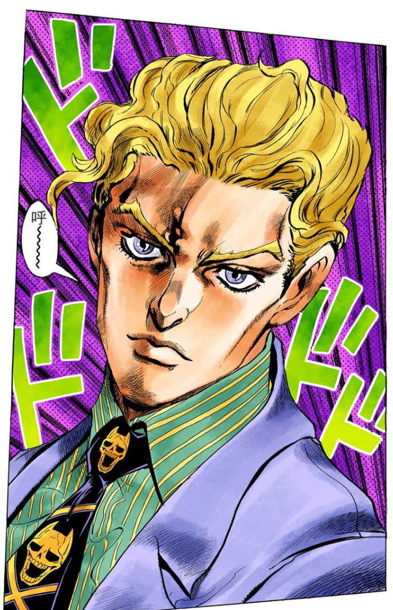

# 加菲猫不过情人节
### [Home](../index)  [Life](./LifeIndex)
今天是2021年2月14日，农历大年初三。
## 我想减肥了
减肥与戒烟一样，是世界上最容易的事之一——因为一年可以戒很多次烟，减很多次肥，甚至可以每天早上减肥晚上不减肥。  
这次减肥想法的产生主要有三个原因。  
一是J哥半年从轻度脂肪肝发展到重度脂肪肝，我们在吹牛打屁的时候我也老劝他减肥。仔细一想有点不对劲，因为我本身也是体重快赶上身高的轻度脂肪肝肥仔啊。  
二是《每逢佳节被催婚》。这个不知道什么受教育程度的小品也真是搞人心态。关键词：小丑、多余、肥宅。  
三是每逢佳节倍思春。
> “一个十八九岁没有女朋友的男孩子，往往心里藏的女人抵得上皇帝三十六宫的数目，心里的污秽有时过于公共厕所。同时他对恋爱抱有崇高的观念，他希望找到一个女人能跟自己心灵契合，有亲密而纯洁的关系，把生理冲动推隔得远远的，裹上重重文饰，不许它露出本来面目。”

## 减肥的目标与计划
减肥无非是热量消耗大于热量摄入，增大热量消耗减少热量摄入。我给自己的初步目标是减10-20斤，维持在70-75kg。这应该是一个比较现实的目标。  
> "我名叫吉良吉影，33岁。住在杜王町东北部的别墅区一带，未婚。我在龟友连锁店服务。每天都要加班到晚上8点才能回家。我不抽烟，酒仅止于浅尝。晚上11点睡，每天要睡足8个小时。睡前，我一定喝一杯温牛奶，然后做20分钟的柔软操，上了床，马上熟睡。一觉到天亮，早上起来就像婴儿一样不带任何疲劳和压力迎接第二天。医生（乔可拉特）都说我没有任何异常。我在向你说明我是一直希望保持内心平静生活的人，不执著于胜负，不纠结于烦恼，不树立让我夜不能寐的敌人，这就是我对社会的态度，也知道这是我的幸福"

我，23岁。住在杭州，未婚。每天都要加班到晚上九点才回家。我不抽烟，酒仅止于浅尝。早上吃全麦面包加鸡蛋配牛奶，中午吃沙拉，晚上随便吃少点。每天都要运动半小时。晚上12点30分睡，每天睡足7小时。睡前，我一定喝一杯温开水，然后做10分钟平板支撑，上了床，马上熟睡。一觉到天亮，早上起来就像婴儿一样不带任何疲劳和压力迎接第二天。  

